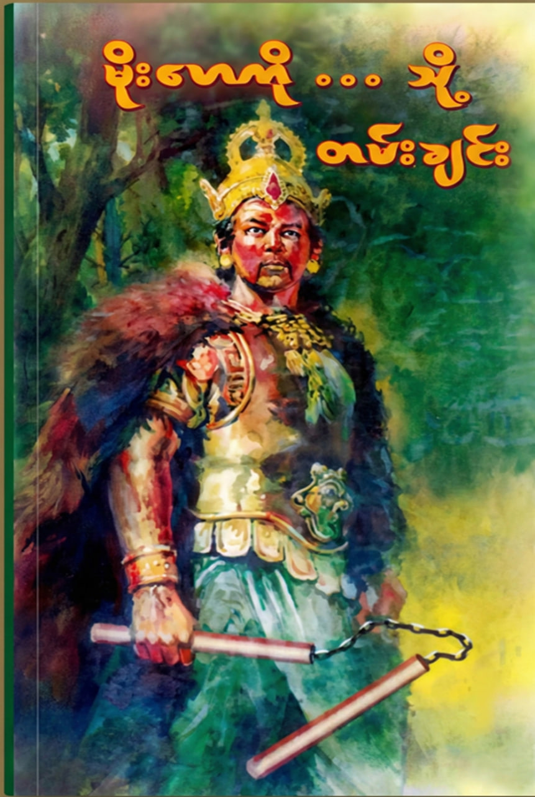

# 📖 Moe Hay Ko Though Tan Chin

> Transforming a classic book into an accessible, SEO-friendly web experience

## 🖼️ Preview

*The classic book, reimagined for modern readers*

---

## ✨ Features

- ✅ **Full SEO optimization** – Metadata, Open Graph, JSON-LD structured data
- ✅ **Responsive design** – Works on mobile, tablet, desktop

## 🚀 Live Demo

**[👉 View Live App](https://moehayko-love.vercel.app/)**

🔍 SEO Implementation

This project uses Next.js Metadata API for:

    📝 Title & description tags

    🔗 Open Graph (Facebook/LinkedIn)

    🐦 Twitter Cards

    📊 JSON-LD structured data

    🌐 Sitemap.xml generation

    🤖 robots.txt
    

📄 License

MIT © KyawMinHtwe
